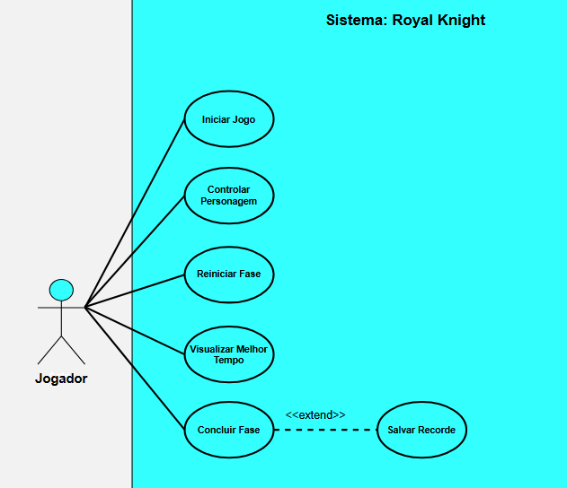
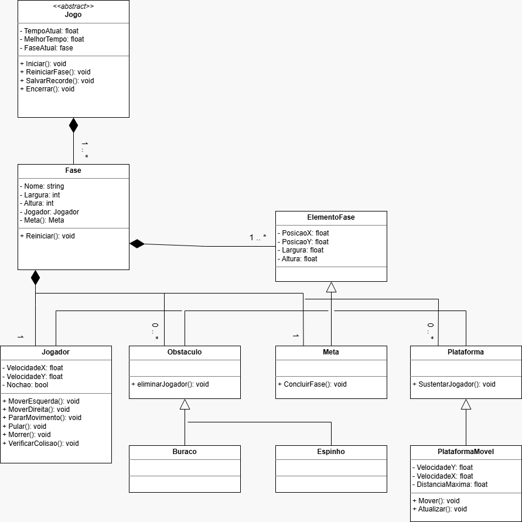

# Análise orientada a objeto

## Descrição Geral do domínio do problema

O projeto consiste no desenvolvimento de um jogo de plataforma 2D com foco em movimentação precisa e responsiva. O jogador deve percorrer uma fase repleta de obstáculos e alcançar o ponto final no menor tempo possível para salvar a princesa.

A proposta do jogo é priorizar a movimentação, inspirado em jogos como Celeste, Hollow Knight e Super Meat Boy. Na versão inicial, o jogo não contará com inimigos, concentrando o desafio em obstáculos como espinhos, buracos e plataformas.

Ao morrer, o jogador retorna ao início da fase e pode tentar novamente até completar o percurso. O sistema registra o melhor tempo obtido, permitindo ao jogador buscar novos recordes.

### Requisitos Funcionais

- Permitir movimentação horizontal do personagem.
- Permitir que o personagem realize saltos.
- Aplicar gravidade ao personagem.
- Detectar colisões com plataformas.
- Detectar colisões com obstáculos.
- Reiniciar a fase quando o jogador morrer.
- Encerrar a fase ao alcançar a meta.
- Exibir o tempo atual da fase.
- Armazenar e exibir o melhor tempo obtido.

### Requisitos Não Funcionais

- Desenvolvido em C++ utilizando Qt Creator.
- Utilizar programação orientada a objetos.
- Código modular.
- Alta responsividade dos controles.
- Possibilidade de expansão futura para novas mecânicas.

### Funcionalidades Futuras

- Wall jump.
- Dash.
- Fast Fall
- Múltiplas fases.
- Efeitos sonoros e música.
- Sistema de seleção de fases.

---

## Diagrama de Casos de Uso

### Ator

- Jogador

### Casos de Uso

- Iniciar jogo
    Ao iniciar o jogo, o sistema carrega a fase inicial, posiciona o personagem no ponto inicial e começa a contar o cronômetro.
- Controlar personagem
    Movimentações do personagem, mover para os lados e pular.
- Reiniciar fase
    Caso o Jogador caia em algum buraco ou encoste em algum espinho o personagem volta ao ponto inicial da fase mas mantém o cronômetro rodando. 
- Concluir fase
    Mostra o tempo levado, concluir fase é acionado quando o Jogador alcança a meta da fase
    - Salvar Melhor Tempo
        Caso o tempo alcançado nesse jogo for inferior ao seu melhor tempo ele salva e guarda como novo melhor tempo.
- Visualizar melhor tempo
    O Jogador consegue visualizar o melhor tempo dele.
- Reiniciar Jogo (implementar)
    Reiniciar as fases e o cronômetro para nova tentativa.

### Representação visual

## Diagrama de Classes

## Descrição das Classes

### Jogo

A classe **Jogo** é responsável por controlar a execução da partida. Ela gerencia a fase atual, controla o tempo da tentativa e armazena o melhor tempo obtido pelo jogador. Também é responsável por iniciar e reiniciar quando necessário.

### Fase

A classe **Fase** representa o cenário jogável. Ela contém todos os elementos presentes na fase, como jogador, plataformas, obstáculos e meta. Além disso, é responsável por controlar a reinicialização da fase.

### ElementoFase

A classe **ElementoFase** representa um elemento genérico presente na fase. Ela fornece atributos comuns, como posição e dimensões, servindo como classe base para os demais elementos do cenário.

### Jogador

A classe **Jogador** representa o personagem controlado pelo usuário. Suas principais responsabilidades são gerenciar a movimentação, realizar saltos e interagir com os elementos da fase por meio de colisões.

### Plataforma

A classe **Plataforma** representa superfícies sólidas sobre as quais o jogador pode se locomover. Sua principal função é fornecer suporte para a movimentação do personagem.

### PlataformaMovel

A classe **PlataformaMovel** é uma especialização de **Plataforma** que possui movimento próprio. Ela adiciona desafios à fase ao alterar sua posição ao longo do tempo.

### Obstaculo

A classe **Obstaculo** representa elementos que oferecem risco ao jogador. Sua função principal é detectar colisões e aplicar seus efeitos quando o personagem entra em contato com eles.

### Espinho

A classe **Espinho** é um tipo de **Obstaculo** que elimina o jogador ao ser tocado. É utilizada para aumentar a dificuldade da fase e exigir precisão na movimentação.

### Buraco

A classe **Buraco** representa uma região perigosa da fase. Caso o jogador caia nela, a tentativa é encerrada e a fase é reiniciada.

### Meta

A classe **Meta** representa o objetivo final da fase. Quando o jogador alcança a meta, a fase é considerada concluída e o sistema verifica a possibilidade de registrar um novo recorde.

---

### Representação visual

[Retroceder](README.md) | [Avançar](projeto.md)

