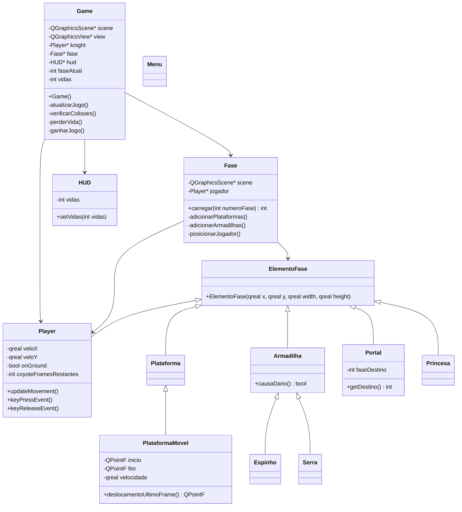
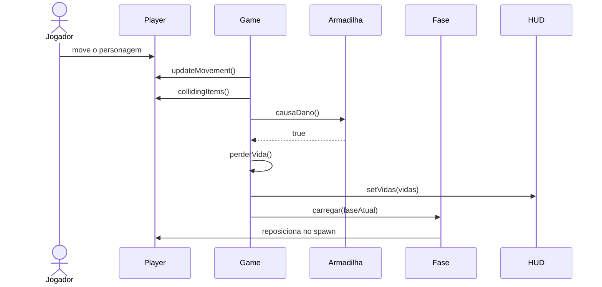

# Projeto orientado a objeto

Esta etapa descreve como o jogo **Royal Knight** foi organizado em classes. A ideia principal foi separar as responsabilidades do jogo para que cada parte do sistema tenha uma função clara: controlar a partida, carregar as fases, representar os elementos do cenário, controlar o jogador e exibir a interface.

## Visão geral da arquitetura

O projeto foi dividido em classes ligadas ao domínio do jogo e em classes de apoio visual. A classe `Game` funciona como o controlador principal da partida. Ela configura a cena, inicia o loop do jogo, controla vidas, cronômetro, troca de fase e vitória. A classe `Fase` ficou responsável por carregar os dados do arquivo JSON e criar os elementos da fase dentro da `QGraphicsScene`.

Os objetos que aparecem no cenário herdam de `ElementoFase`, que representa uma base comum para elementos posicionados na fase. A partir dela foram criadas classes como `Player`, `Plataforma`, `Portal`, `Princesa` e `Armadilha`. As armadilhas concretas, como `Espinho` e `Serra`, herdam de `Armadilha`. A `PlataformaMovel` herda de `Plataforma`, pois é uma plataforma comum com comportamento adicional de movimento.

## Principais classes

### Game

Classe principal da partida. Ela configura `QGraphicsScene`, `QGraphicsView`, HUD, cronômetro e loop de atualização. Também verifica colisões importantes, como contato com portal, princesa e armadilhas.

### Fase

Responsável por carregar a fase atual a partir de `fases.json`. Ela cria plataformas, plataformas móveis, portais, armadilhas e princesa, além de reposicionar o jogador no ponto de início da fase.

### ElementoFase

Classe base dos elementos posicionados no cenário. Ela guarda a estrutura comum de posição e tamanho usando `QGraphicsRectItem`, servindo como ponto de herança para os demais objetos da fase.

### Player

Representa o personagem controlado pelo jogador. Controla entrada pelo teclado, movimento horizontal, pulo, gravidade, fast fall, coyote time, colisões com plataformas e animações por sprites.

### Plataforma e PlataformaMovel

`Plataforma` representa uma superfície sólida. `PlataformaMovel` especializa esse comportamento, adicionando deslocamento automático entre dois pontos. Quando o jogador está sobre uma plataforma móvel, ele acompanha seu movimento.

### Armadilha, Espinho e Serra

`Armadilha` é a classe base para objetos que causam dano ao jogador. `Espinho` e `Serra` herdam dela e implementam formas visuais e hitboxes diferentes. O jogo trata ambas de maneira genérica como `Armadilha`.

### Portal e Princesa

`Portal` representa a passagem entre fases. Ao colidir com ele, o jogador avança para a fase de destino. `Princesa` representa o objetivo final da fase, encerrando a partida com vitória.

### Menu e HUD

`Menu` apresenta a tela inicial, os botões de jogar e sair e o melhor tempo salvo. `HUD` exibe as vidas do jogador durante a partida.

## Diagrama de classes

## Diagrama de interação: dano em armadilha

O diagrama abaixo representa o fluxo quando o jogador encosta em uma armadilha.

[Retroceder](analise.md) | [Avançar](implementacao.md)

